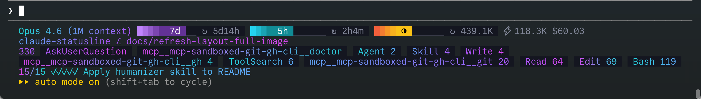
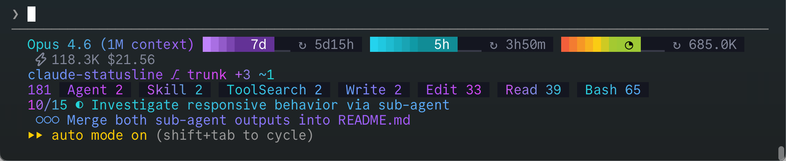
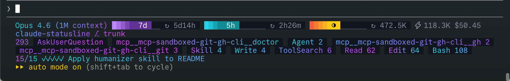
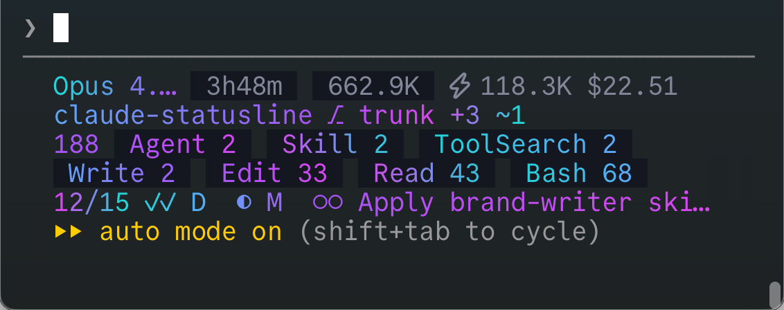

# claude-statusline

A single-file zsh statusline for [Claude Code](https://claude.com/claude-code).
It renders up to three rows of live session state and fits them into
whatever terminal width Claude Code hands it.



## Install

Two paths. The non-developer path uses Finder and TextEdit only. The
developer path uses a terminal. Pick whichever fits.

### Non-developer path (macOS, no terminal)

You need a working Claude Code install. Everything else happens in Finder
and TextEdit.

**1. Download the project.**

Click this link. Your browser downloads a zip file to the **Downloads**
folder:

[**claude-statusline-trunk.zip** (direct download)](https://github.com/nerdalytics/claude-statusline/archive/refs/heads/trunk.zip)

**2. Unzip it.**

Open the **Downloads** folder in Finder. Double-click
`claude-statusline-trunk.zip`. macOS extracts a folder called
`claude-statusline-trunk`. Open that folder. Find the file named
`statusline.zsh`. That is the one file you are installing.

**3. Open your home folder.**

In Finder, press `⌘` + `⇧` + `H` (command, shift, H). Finder shows your
home folder, which contains **Desktop**, **Documents**, **Downloads**,
and a few others.

**4. Make hidden folders visible.**

Claude Code keeps its settings in a folder called `.claude` inside your
home folder. Folders whose name starts with a dot are hidden by default.

In Finder, press `⌘` + `⇧` + `.` (command, shift, period). Hidden
folders appear. `.claude` should now be visible among the others. Press
the same keys later to hide them again.

<details>
<summary>What if <code>.claude</code> is missing entirely?</summary>

Open Claude Code at least once. Claude Code creates the folder on first
launch. Then come back to this step.

</details>

**5. Move the script into `.claude`.**

Drag `statusline.zsh` from the extracted folder into `.claude`. If macOS
asks whether to replace an existing file with the same name, click
**Replace**.

**6. Open the settings file.**

Inside `.claude`, look for a file called `settings.json`. Right-click it
and choose **Open With → TextEdit**.

<details>
<summary>What if <code>settings.json</code> does not exist yet?</summary>

Right-click in the empty area inside `.claude` and choose **New
Document**, or create the file from TextEdit (**File → New**, then save
as `settings.json` into `.claude`).

</details>

**7. Switch TextEdit to plain text.**

In TextEdit's **Format** menu, click **Make Plain Text** if that option
is there. If you see **Make Rich Text** instead, the file is already
plain text and you can leave it alone.

TextEdit has to be in plain text mode, otherwise it saves invisible
formatting that Claude Code cannot parse.

**8. Paste in the settings block.**

If `settings.json` is empty, paste this in exactly:

```json
{
  "statusLine": {
    "type": "command",
    "command": "zsh ~/.claude/statusline.zsh",
    "refreshInterval": 1
  }
}
```

<details>
<summary>What if <code>settings.json</code> already contains other settings?</summary>

Keep what is there and add only the `"statusLine": { ... }` key alongside
them, separated by a comma. When in doubt, copy the whole file into
[jsonlint.com](https://jsonlint.com). It will tell you whether the shape
is valid.

</details>

Save with `⌘` + `S`. Close TextEdit.

**9. Restart Claude Code.**

In your Claude Code prompt, type `/exit` and press Enter. That shuts
down Claude Code cleanly and returns you to your terminal's shell
prompt. Then start Claude Code again:

```sh
claude
```

The statusline appears above your next prompt.

<details>
<summary>What if <code>claude</code> prints <code>command not found</code>?</summary>

Try `claude-code` instead. The command name depends on how Claude Code
was installed on your machine. Use whichever one you used the first
time.

</details>

<details>
<summary>Why not <code>⌘</code> + <code>Q</code>?</summary>

Claude Code runs inside a terminal app. `⌘` + `Q` would close the
terminal window rather than let Claude Code shut down properly. Always
use `/exit`.

</details>

#### If nothing changed

- Check the filename in `.claude`. It has to be `settings.json`, not
  `settings.json.txt`. If TextEdit appended `.txt`, rename the file and
  remove the extra extension.
- Check that `statusline.zsh` sits directly inside `.claude`, not inside
  a subfolder.
- Open `settings.json` again. Confirm the `statusLine` block is still
  there and still valid JSON (use [jsonlint.com](https://jsonlint.com)
  to check).

<details>
<summary><b>Developer path</b> — clone, symlink, paste JSON block, restart. Linux notes and a verify command inside.</summary>

```sh
git clone https://github.com/nerdalytics/claude-statusline.git ~/code/claude-statusline
ln -sfn ~/code/claude-statusline/statusline.zsh ~/.claude/statusline.zsh
```

Add a `statusLine` block to `~/.claude/settings.json`:

```json
{
  "statusLine": {
    "type": "command",
    "command": "~/.claude/statusline.zsh",
    "refreshInterval": 1
  }
}
```

Restart Claude Code.

**Linux:** same flow. Clone anywhere, symlink into `~/.claude`. Make
sure `zsh`, `jq`, and `git` are on `PATH`. `jq` is not bundled with
most Linux distributions, so install with `apt install jq`,
`dnf install jq`, or your distro equivalent.
[`gh`](https://cli.github.com/) is optional and drives the PR-related
segments on the REPO row; everything else works without it.

**Verify:**

```sh
echo '{"model":{"display_name":"Claude Sonnet 4"},"context_window":{"current_usage":{"input_tokens":50000},"context_window_size":200000}}' \
  | zsh ~/.claude/statusline.zsh
```

A gradient `Claude Sonnet 4` followed by a 25%-full context bar means
the script is wired up correctly.

</details>

## Configure

The script reads configuration from three places:

| Source                           | Purpose                                               |
|----------------------------------|-------------------------------------------------------|
| `~/.claude/settings.json`        | Main Claude Code settings                             |
| `~/.claude/settings.local.json`  | Per-machine overrides. Local wins if both are present |
| `~/.claude/statusline.conf`      | Optional zsh file sourced at startup for script vars  |

### `statusLine.refreshInterval` (integer)

Lives in `settings.json`. Controls how often Claude Code re-runs the
statusline script, in seconds. Lower values mean the bars and counters
update closer to real time; higher values reduce the render load at the
cost of staleness.

```json
{ "statusLine": { "refreshInterval": 1 } }
```

The minimum (and recommended) value is `1`. It keeps the rate-limit
bars, context bar, and tool counters fresh. Set it higher if you want
the statusline to refresh less often.

### `statusLine.padding` (integer)

Lives in `settings.json` or `settings.local.json`. The script reads your
terminal's column count, subtracts `4` for Claude Code's left chrome, then
subtracts this value. Set it when something else on screen consumes
horizontal space, such as a tmux status bar on the right edge or an IDE
gutter.

```json
{ "statusLine": { "padding": 6 } }
```

Default is `0` (no extra subtraction beyond the built-in 4).

### `AUTOCOMPACT_BUFFER` (integer)

Set in `~/.claude/statusline.conf`. Subtracted from the context-window
size before usage is computed. Use it when Claude Code's autocompact
feature reserves a token buffer you want the bar to account for. With
the buffer set, `100%` on the context bar means autocompact is about to
fire, not that the hard context limit has been reached.

Claude Code's current default is `33000` (33k tokens), visible at the
bottom of the `/context` panel. Match that value unless you know your
install uses a different reserve:

```sh
# ~/.claude/statusline.conf
AUTOCOMPACT_BUFFER=33000
```

### `SMART_CONTEXT_LIMIT` (integer)

Set in `~/.claude/statusline.conf`. The token boundary between the **smart
zone** (precise recall) and the much larger **dumb zone** (vague recall). The
context-bar badge shows a sharp diamond (`◇ ◆`) while used tokens stay at or
below this limit, and flips to a filling moon (`○ ◔ ◑ ◕ ●`) once they cross it
— the cue that it is time to clear the context. It is an absolute token count,
so the smart zone is a fixed size regardless of the model's context window.

Default is `200000` (200k tokens). There is no published "recall degrades at N
tokens" figure; treat this as a heuristic and tune it to taste:

```sh
# ~/.claude/statusline.conf
SMART_CONTEXT_LIMIT=200000
```

### `DEFAULT_BRANCH` (string)

Set in `~/.claude/statusline.conf`. Overrides git default-branch detection.
The script normally reads `refs/remotes/origin/HEAD`. Set this when your
repository's HEAD symref is not configured.

```sh
DEFAULT_BRANCH=main
```

### `STATUSLINE_DEBUG` (environment variable)

Set to any non-empty value to append a diagnostic line to
`/tmp/statusline-responsive.log` on each render. The line records the
detected column width and the measured width of every row.

```sh
STATUSLINE_DEBUG=1 echo '{"model":{"display_name":"Test"}}' | zsh ~/.claude/statusline.zsh
```

## What you see on screen

Up to three rows. Each row appears only when it has content.

| Row   | Content                                                                                                                           |
|-------|-----------------------------------------------------------------------------------------------------------------------------------|
| META  | Model name, 7-day rate bar, 5-hour rate bar, context-window bar, agent tokens, session cost                                       |
| REPO  | Project directory, branch, worktree, PR number and state and review, comments, sync with remote, mergeability, CI checks, dirty files |
| TOOLS | Total tool-call count, per-tool chips with counts, currently running tool                                                          |

### META row

| Segment         | What it shows                                                                                                               | Visible when                                                        |
|-----------------|-----------------------------------------------------------------------------------------------------------------------------|---------------------------------------------------------------------|
| **model**       | Model display name (`Claude Sonnet 4`, `Opus 4.6 (1M context)`). Rendered as a teal→purple gradient.                         | Always                                                              |
| **rate7d**      | 7-day rate-limit usage as a 7-cell bar with a `7d` badge. Purple gradient. Suffix shows time-to-reset (`↻ 5d16h`).            | `rate_limits.seven_day` is in the input JSON                        |
| **rate5h**      | 5-hour rate-limit usage as a 10-cell bar with a `5h` badge. Cyan gradient. Suffix shows time-to-reset (`↻ 4h19m`).            | `rate_limits.five_hour` is in the input JSON                        |
| **context**     | Context-window usage as a 10-cell bar. Badge marks the recall zone — smart (`◇ ◆`) vs dumb (`○ ◔ ◑ ◕ ●`), see below. Suffix is remaining tokens (`↻ 142.5K`). Green→yellow→red. | `context_window.current_usage` is present and window size > 0       |
| **agent_tokens**| Tokens consumed by sub-agents (`⚡12.3K`). Muted gray.                                                                        | At least one sub-agent reported tokens in the transcript            |
| **cost**        | Session cost in USD (`$1.42`). Muted gray.                                                                                   | `cost.total_cost_usd` is present and non-zero                       |

**Fill-bar anatomy** (applies to all three bars):

| Part          | Example    | Meaning                                                          |
|---------------|------------|------------------------------------------------------------------|
| Filled cells  | `████`     | Used portion. Coloured by gradient.                              |
| Badge         | `▕ 7d ▏`   | Label with auto-contrast foreground on a coloured background.    |
| Empty cells   | `▁▁▁`      | Unused portion. Dim.                                             |
| Suffix        | `↻ 2d14h`  | Reset countdown (rate bars) or remaining tokens (context bar).   |

**Context bar overflow.** When remaining tokens fall below zero (after
`AUTOCOMPACT_BUFFER` is accounted for), the bar switches to red→purple
colouring and shows the `⊙` glyph.

### REPO row

Every REPO segment requires the current working directory to be inside a
git repository.

| Segment          | Shows                                                                                                                                         | Visible when                               | Example                    |
|------------------|-----------------------------------------------------------------------------------------------------------------------------------------------|--------------------------------------------|----------------------------|
| **project**      | Directory name. Clickable (OSC 8 hyperlink to the directory).                                                                                 | In a git repo                              | `claude-statusline`        |
| **branch**       | Current branch, prefixed `⎇`. When the branch was cut from a non-default branch, shows the ancestry chain. Clickable.                          | In a git repo                              | `⎇ trunk` / `⎇ main ⎇ feat`|
| **worktree**     | Worktree name, prefixed `⎇`. Only shown when the worktree name differs from the branch name.                                                   | A worktree is active with a distinct name  | `⎇ review-pr-42`           |
| **pr_number**    | Pull-request number for the current branch.                                                                                                   | A PR exists for the branch                 | `#142`                     |
| **pr_state**     | Draft indicator.                                                                                                                              | The PR is a draft                          | `✎`                        |
| **pr_review**    | Review decision.                                                                                                                              | A review decision exists                   | `✓` / `✗` / `⋯`             |
| **pr_comments**  | Comment count.                                                                                                                                | PR has ≥ 1 comment                         | `✉ 3`                      |
| **git_sync**     | Ahead/behind counts vs. upstream, or vs. the default branch when no upstream is set.                                                          | Branch diverges from remote                | `↑2 ↓1`                    |
| **pr_mergeable** | Conflict warning.                                                                                                                             | PR mergeable status is `CONFLICTING`       | `⚠`                        |
| **pr_checks**    | CI summary. Pending, failed, and passed counts. Compact form when everything passes.                                                          | PR has ≥ 1 status check                    | `✓12` / `○2 ✗1 ✓9`          |
| **git_dirty**    | Lines added, lines deleted, files changed vs. HEAD.                                                                                           | Working tree has uncommitted changes       | `+45 -12 ~3`               |

### TOOLS row

Appears when at least one tool has been used this session.

| Part                | Shows                                                                                                               | Example              |
|---------------------|---------------------------------------------------------------------------------------------------------------------|----------------------|
| **Total count**     | Purple number at the start. Total tool uses across all tools, including sub-agents.                                  | `142`                |
| **Completed chips** | One chip per distinct tool, sorted by count ascending. `name N` when count > 1, just `name` otherwise.               | `Read 39` `Edit 33`  |
| **Running tool**    | Currently-executing tool, prefixed `◐`. Shows target (file path, command, pattern, prompt) when available.           | `◐ Bash: git status` |

### Icon glossary

| Icon  | Meaning                                     | Where                                            |
|-------|---------------------------------------------|--------------------------------------------------|
| `↻`   | Time-to-reset / remaining tokens            | Bar suffixes                                     |
| `⎇`   | Git branch or worktree                      | REPO                                             |
| `⚡`   | Agent token usage                            | META                                             |
| `$`   | Session cost                                | META                                             |
| `◐`   | In progress / currently running             | TOOLS                                            |
| `◇ ◆` | Context smart zone (precise recall)         | META context bar                                 |
| `○ ◔ ◑ ◕ ●` | Context dumb zone (vague recall), filling | META context bar                            |
| `⊙`   | Context past the usable limit               | META context bar                                 |
| `✓`   | Completed / CI pass / review approved       | REPO                                             |
| `✗`   | CI fail / review requested changes          | REPO                                             |
| `⋯`   | Review required                             | REPO                                             |
| `✎`   | Draft PR                                    | REPO                                             |
| `✉`   | PR comments                                 | REPO                                             |
| `↑`   | Commits ahead of remote                     | REPO                                             |
| `↓`   | Commits behind remote                       | REPO                                             |
| `⚠`   | Merge conflict                              | REPO                                             |
| `+`   | Lines added                                 | REPO                                             |
| `-`   | Lines deleted                               | REPO                                             |
| `~`   | Files changed                               | REPO                                             |
| `█`   | Filled bar cell                             | META bars                                        |
| `▁`   | Empty bar cell                              | META bars                                        |

**Context bar badge.** The glyph marks the *recall zone* the session is in,
not raw fill. The **smart zone** is precise-recall context (used tokens at or
below `SMART_CONTEXT_LIMIT`, 200k by default); past it is the much larger
**dumb zone**, where recall turns vague. A sharp diamond covers the small
smart zone in two states; a moon covers the larger dumb zone in five. The flip
from `◆` to `○` is the cue that it is time to clear the context.

| Glyph | Zone | Used tokens |
|-------|------|-------------|
| `◇`   | Smart, first half             | ≤ ½ × `SMART_CONTEXT_LIMIT`             |
| `◆`   | Smart, approaching the line   | ½ × limit … `SMART_CONTEXT_LIMIT`       |
| `○ ◔ ◑ ◕ ●` | Dumb, filling toward the usable limit | `SMART_CONTEXT_LIMIT` … usable limit |
| `⊙`   | Overflow                      | past the usable limit (remaining < 0)   |

On a model whose window is smaller than `SMART_CONTEXT_LIMIT` (e.g. a 200k
window), the whole window is smart, so the badge never leaves the diamond.

## How it adapts to narrow terminals

Four full rows want more horizontal space than most terminals have. The
script runs three sequential passes each time Claude Code triggers a
render. It wraps rows wider than the terminal, enforces a six-line budget
across the whole display, then shrinks the widest remaining row one step
at a time until everything fits.

### Measuring available width

`sl_detect_width` computes how many columns the statusline has to work
with.

1. Read the terminal's column count. First `$COLUMNS`. If that is unset,
   walk the process tree up to 8 ancestors looking for a real TTY and
   run `stty size`. If nothing works, fall back to 9999.
2. Read `statusLine.padding` from `settings.json` or `settings.local.json`
   (local wins).
3. Subtract `4` (Claude Code's left chrome) plus `statusLine.padding`.

A 120-column terminal with `statusLine.padding: 2` gives the statusline
114 columns to work with.

### The three passes

**Pass 1: wrap.** `_sl_try_wrap` tests any row wider than the available
width. It walks segments left to right and finds the last clean boundary
where the first half fits on one line and the second half also fits. Bar
fills are never split mid-gradient. When both halves fit, the row renders
on two physical lines. When no clean split exists, the row stays on one
line.

META wraps after the rate bars when its width exceeds the terminal:



TOOLS wraps at a chip boundary when there are too many chips to fit:



**Pass 2: six-line budget.** Wrapped rows count as 2 physical lines,
unwrapped rows as 1. When the total exceeds 6 lines:

1. Un-wrap the lowest-priority rows first (reverse of `SL_LAYOUT_ORDER`,
   skipping the protected first entry).
2. If the total is still over budget, remove whole rows in reverse
   priority until it fits.

**Pass 3: shrink the widest.** A loop of up to 500 iterations finds the
widest row still exceeding its allowed width (1 line unwrapped, 2 if
wrapped) and calls that row's shrink state machine for one atomic step.
The row is re-measured after each step. When a row's shrink function
reports "exhausted" the row is removed entirely. META is the exception.
When META still does not fit after all its shrink steps, every other row
is removed to make room.

### Row priority

`SL_LAYOUT_ORDER=(meta repo tools)` defines both the display order
and the shrink priority. Index 1 (META) is protected and never removed.
When the budget demands it, the rest are removed in reverse order: TOOLS
first, then REPO.

To customise, override `SL_LAYOUT_ORDER` before `sl_layout` runs. Example,
swapping the TOOLS and REPO rows:

```zsh
SL_LAYOUT_ORDER=(meta tools repo)
```

### META row: 17 shrink steps

META is data-driven by the `_SL_META_SHRINK_SEQUENCE` array. An implicit
Step 0 runs first, then the 17 explicit steps execute in order, one per
call, until the row fits.

**Step 0 (iterative).** Truncates the model name one character at a time,
right to left, down to a "first-word second-word" minimum. `Opus 4.6 (1M
context)` shrinks through `Opus 4.6 (1M contex…` → `Opus 4.6 (1M conte…`
→ … → `Opus 4.6`, then stops.

The 17 steps run in priority order. Compact the rate bars first, then
strip badge spaces, clear badge text, drop the context glyph, strip
the refresh icon, clear the bar ranges entirely. Only after all that
does the row start dropping segments: agent tokens, then cost, then
the model name itself.

<details>
<summary>Show the full 17-step table</summary>

| Step | Action                                                                                                                  |
|------|-------------------------------------------------------------------------------------------------------------------------|
|  1   | Compact the 7-day bar. Clear fill cells; keep only badge and suffix.                                                    |
|  2   | Compact the 5-hour bar.                                                                                                 |
|  3   | Strip the leading space from the 7-day badge text (` 7d ` → `7d `).                                                      |
|  4   | Strip the leading space from the 5-hour badge text.                                                                      |
|  5   | Compact the context bar. Clear fill cells; keep badge and suffix.                                                       |
|  6   | Clear the 7-day badge text entirely.                                                                                    |
|  7   | Clear the 5-hour badge text entirely.                                                                                   |
|  8   | Strip the context badge's leading space and change its role to `spacer`. The zone glyph stays visible longer this way. |
|  9   | Drop the context zone glyph (`◇ ◆ ○ ◔ ◑ ◕ ● ⊙`).                                                                         |
|  10  | Remove the `↻ ` refresh icon from the 7-day bar suffix.                                                                 |
|  11  | Remove the `↻ ` refresh icon from the 5-hour bar suffix.                                                                |
|  12  | Remove the `↻ ` refresh icon from the context bar suffix.                                                               |
|  13  | Clear the entire 7-day bar range.                                                                                       |
|  14  | Clear the entire 5-hour bar range.                                                                                      |
|  15  | Drop the agent-tokens segment (`⚡12.3K`).                                                                                |
|  16  | Drop the cost segment (`$1.42`).                                                                                        |
|  17  | Drop the model name.                                                                                                    |

</details>

### REPO row: 6 shrink phases

Truncates project, branch, and worktree names one character at a time
(phases 0–2), then removes each segment in the same order (phases 3–5).
Once phase 5 is exhausted, the orchestrator removes the REPO row.

<details>
<summary>Show the full phase table</summary>

| Phase | Action                                                                                                             |
|-------|--------------------------------------------------------------------------------------------------------------------|
|  0    | Truncate the project name, right to left, down to 1 character.                                                     |
|  1    | Truncate the branch name, right to left. The ` ⎇ ` prefix is preserved.                                             |
|  2    | Truncate the worktree name, right to left. The ` ⎇ ` prefix is preserved.                                           |
|  3    | Remove the project segment entirely.                                                                               |
|  4    | Remove the branch segment entirely.                                                                                |
|  5    | Remove the worktree segment entirely.                                                                              |

</details>

### TOOLS row: 5 shrink phases

Strips the `mcp__` prefix from MCP chips first, then left-truncates
long MCP names, right-truncates long regular names, walks back the `…`
ellipsis to individual dots, and finally collapses short chips to a
single letter.

<details>
<summary>Show the full phase table</summary>

Chip style is ` name count ` or ` name `. Shrink targets the `tool_seg`
roles between `chip_start` and `chip_end`.

| Phase | Action                                                                                                                 |
|-------|------------------------------------------------------------------------------------------------------------------------|
|  0    | Strip the `mcp__` prefix from the leftmost MCP chip (`mcp__claude-in-chrome` → `claude-in-chrome`).                     |
|  1    | Left-truncate MCP chips with `…`, leftmost first.                                                                       |
|  2    | Right-truncate regular chips longer than 4 characters, adding `…`.                                                      |
|  3    | Walk back existing truncation: `…` → `..` → `.` → first letter only.                                                    |
|  4    | Collapse any remaining 4-character-or-shorter chip to its first letter, leftmost first.                                  |

</details>

### When nothing else fits

When META still exceeds the available width after all 17 shrink steps
have run and the model name is gone, the orchestrator drops REPO and
TOOLS immediately. META renders on whatever content survived, usually
just a badge or two.

Under extreme width pressure the script compacts the bars and strips
almost everything else off. What remains:



## Contributing

Source: [github.com/nerdalytics/claude-statusline](https://github.com/nerdalytics/claude-statusline).
Issues and pull requests accepted.
